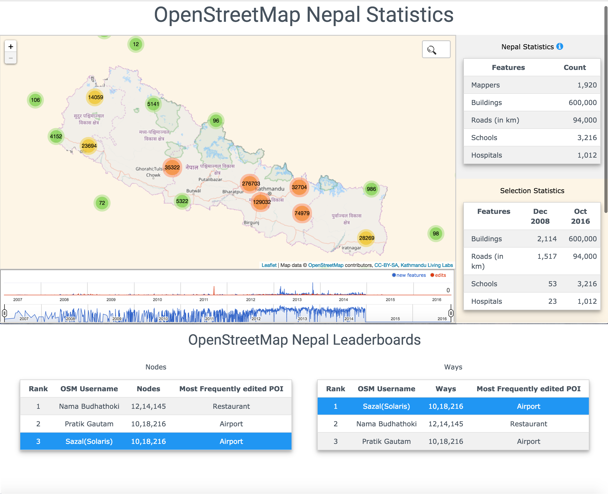

#Readme for Nepal OSM History Visualizer

The **Nepal OSM History Visualizer** is a project by Kathmandu Living Labs and the Dartmouth Dickey Center.  It was built by Sazal and Max, and designed by Paras and Sazal.



This project is an attempt to replicate the features of the [OpenStreetMaps Analytics Tool](http://osm-analytics.org) (OSMA).  The primary difference is that we are incorporating full edit history, meaning that our database and our metadata (charts, graphs, statistics, etc.) take into account every single edit ever done to every single feature, even if that edit is not currently visible.  OSMA does not do this, and they acknowledge it as a major limitation in their [README](https://github.com/hotosm/osm-analytics).

To make this work, you're going to need to do a few things.

1.  You need to install MAMP.
2.  When you clone this, clone it in:

	> /Applications/MAMP/htdocs/

	For example,

	> cd /Applications/MAMP/htdocs/
	> 
	> git clone https://github.com/maxvonhippel/NepalOSMHistory.git

3.  You need to make a GeoJSON file with some data in Nepal and name it **dirtydata.json**, and put it in the **data** folder in the repository.  

	(Or name it whatever you want, use data from wherever you want, and modify [jsonclustermap.js](https://github.com/maxvonhippel/NepalOSMHistory/blob/master/js/jsonclustermap.js) accordingly.  It's not a complex script, you can easily modify it to fit your needs.)  

	We will add code and instructions for database generation, population, querying, etc. soon, and when we do so you will be able to use our toolset to create this file.  For now, if you want to play with this repo, just know that the format of the file looks like this:

```GEOJSON
{
	"type":"FeatureCollection",
	"features":[
		{
			"type":"Feature",
			"geometry":{
				"type":"Point",
				"coordinates":[85.3019553,27.7257842]
			},
			"properties":{
				"feature_id":31303849,
				"id":4627,
				"version":1,
				"uid":"7094",
				"user":"Eratosthenes",
				"timestamp":"2007-07-05T01:42:23+05:45"
			}
		},
		"etc":"...etc"
	]
}

```
This is in accordance with the GeoJSON [spec](http://geojson.org/geojson-spec.html).  Note that your GeoJSON absolutely *does not* have to be pretty.  In fact, the file we use (which is generated in GeoDjango/PostGIS) looks like this:

```GEOJSON
{"type":"FeatureCollection","features":[{"type":"Feature","geometry":{"type":"Point","coordinates":[85.3019553,27.7257842]}, etc

```
Using an ugly GeoJSON file significantly reduces file size.

You can reach Max on Twitter [`@_m_vh`](https://twitter.com/_m_vh), or Kathmandu Living Labs [`@KTMLivingLabs`](https://twitter.com/KTMLivingLabs).  Feel free to fork.  **MIT License with Attribution.**

#TODO

1. Google Charts is too slow right now.  It either needs to be optimized for at minimum 50% speed increase, or replaced with an alternative such as [D3.JS](http://bl.ocks.org/mbostock/34f08d5e11952a80609169b7917d4172) (I can't get this to not look like garbage when squeezed to be less tall, maybe worth giving another shot later on) or [Dygraphs](http://dygraphs.com/tests/range-selector.html) (see [article relating to Dygraphs and R](https://rstudio.github.io/dygraphs/gallery-range-selector.html)).
2. `cards.js` needs to send queries to GeoDjango server per Sazal's API, get the response, and update accordingly per user selections.
2. `fillmap.js` needs user and place search.


#Prerequisites/Dependencies

* GIT Submodules:
	* [Salsify's PHP JSON Streamer](https://github.com/salsify/jsonstreamingparser)
		* MAMP or XAMPP
		* php > 5.4
		* composer for php 
			* [instructions for Windows - php & Composer](http://i.justrealized.com/2013/install-composer-windows/)	
	* [PruneCluster](https://github.com/SINTEF-9012/PruneCluster)
	
Remember to [initialize and pull the submodules](http://stackoverflow.com/questions/1030169/easy-way-pull-latest-of-all-submodules), too.  Also, you need to initialize composer, and require the json streamer.

The following list of commands should (hopefully) work:

```bash
# go to the path in your MAMP/XAMPP/etc server where you plan to host the project
cd /path/to/your/server/htdoc
# clone the project
git clone https://github.com/maxvonhippel/NepalOSMHistory.git
cd NepalOSMHistory
# clone the submodules
git submodule update --init --recursive
# set up composer
cd server
composer init
composer require salsify/json-streaming-parser:dev-master
composer update
cd plugins/phpjson
composer update
```